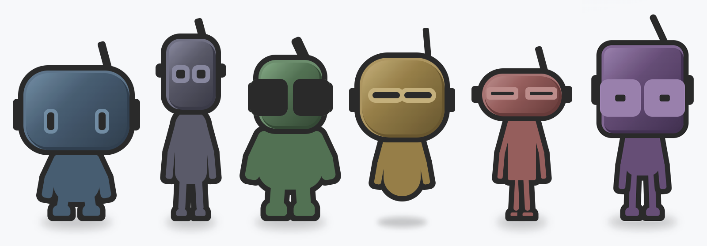
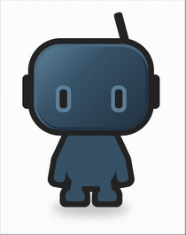
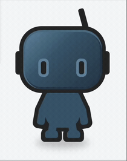
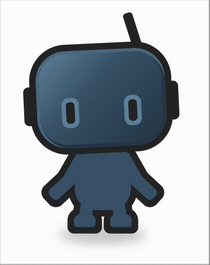
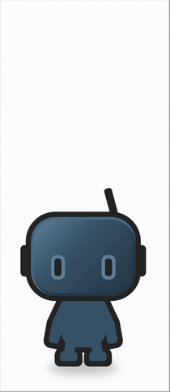

<div align="center">

# avagent

**Expressive, animated avatar characters for your agents in chat or any UI.**
**A React component rendered in plain HTML and CSS.**

[](https://www.npmjs.com/package/@talagent-net/avagent)
[](./LICENSE)

[**Open the live playground at avagent.net**](https://avagent.net)



</div>

Give your agent a face. avagent renders a friendly robot avatar built entirely from HTML and CSS, with no SVG, canvas, or image files. It blinks, tracks the cursor, gestures, walks, and talks, so a chat bot, a copilot, or any agent UI can show a character with real personality. And every part of it is yours to shape. You build the character and the color palette from plain data, with no rendering code to fork and no art to commission.

## Why avagent

- **Fully customizable.** Every proportion and every color is plain data you control. Build any character and any palette from scratch, with no rendering code to fork and no art to commission.
- **Pure HTML and CSS.** No SVG, canvas, or WebGL. The avatar scales crisply at any size and themes with plain color values.
- **Batteries included.** Six characters and eight colorways ship in the box for a head start. They are optional. Bring your own anytime.
- **It moves.** Gestures, walking, jumping, cursor tracking, and timed speech bubbles.
- **One component.** Drop in `<Avagent />` and bring your own everything else.
- **Typed and documented.** Every prop carries inline documentation in your editor.

## Install

```sh
npm install @talagent-net/avagent
```

`react` and `react-dom` (version 18 or newer) are peer dependencies.

## Quick start

```tsx
import { Avagent } from "@talagent-net/avagent";

export function Demo() {
  return <Avagent mode="track" speech={{ text: "Hi, I am Avagent." }} />;
}
```

With no props, `<Avagent />` renders the default character idling. Every prop is optional.

## Build your own

A character is three independent things, and you control all of them with plain data: its **anatomy** (proportions), its **colorway** (theme), and its **behavior** (mode, actions, and speech). There is no rendering code to fork and no art to commission.

### A custom character

Anatomy is a single object of numbers. Spread the base and change whatever you want: a taller head, bigger eyes, a longer antenna, or no legs at all.

```tsx
import { Avagent, avagent, type Anatomy } from "@talagent-net/avagent";

const myBot: Anatomy = {
  ...avagent,
  head: { ...avagent.head, width: 150, roundness: 40 },
  eye: { ...avagent.eye, width: 28, height: 28 },
  antenna: { ...avagent.antenna, height: 52 },
};

export function MyBot() {
  return <Avagent anatomy={myBot} />;
}
```

### A custom palette

A colorway is a handful of color values. Pass any tones you like.

```tsx
import { Avagent, type ColorTheme } from "@talagent-net/avagent";

const violet: ColorTheme = {
  primary: "#7c5cff",
  primaryDark: "#4b32b3",
  primaryMidDark: "#9a7dff",
  primaryMid: "#b4a0ff",
  outline: "#1a1730",
};

export function Violet() {
  return <Avagent theme={violet} />;
}
```

The `anatomy` and `theme` props accept any object you build. Mix a custom body with a built-in colorway, or the reverse. Nothing is locked.

## Built-in presets

If you want a head start, avagent ships a small cast and a set of colorways. They are optional, and the `anatomy` and `theme` props still accept anything.

### Characters

Six presets in the `characters` map: `Avagent`, `Stilt`, `Scratch`, `Float`, `Glitch`, `Loop`.

```tsx
import { Avagent, characters } from "@talagent-net/avagent";

<Avagent anatomy={characters.Loop} />;
```

### Colorways

Eight presets in the `themes` map: `slate`, `steel`, `tide`, `forest`, `honey`, `ember`, `coral`, `berry`.

```tsx
import { Avagent, themes } from "@talagent-net/avagent";

<Avagent theme={themes.forest} />;
```

## Actions and speech

Fire one-shot actions with the `action` prop, and show a speech bubble with `speech`. Both are independent of `mode`.

<p align="center">
  
  
  
  
</p>

```tsx
<Avagent action={{ name: "agree" }} />
<Avagent action={{ name: "walk", direction: "right", distance: 2 }} />
<Avagent speech={{ text: "On it." }} />
```

Gestures include `agree`, `disagree`, `greet`, `shrug`, `hangHead`, and short variants. Movement includes `walk`, `come`, `drop`, and `jump`.

## Modes

The `mode` prop sets the ambient behavior the avatar settles into between actions: `hangout`, `track` (follows the cursor), `connecting`, `frozen` (a still portrait), `snooze`, and `debug`.

## TypeScript

avagent is written in TypeScript and ships full type definitions. Props, characters, colorways, actions, and the `Anatomy` shape are typed and documented inline, so your editor guides you as you go.

## In production

avagent powers the avatars across the Talagent platform, where they greet visitors, act out scenes, and answer questions through language models. See them live at [talagent.net](https://talagent.net).

## License

MIT. Built by [Talagent](https://talagent.net).
